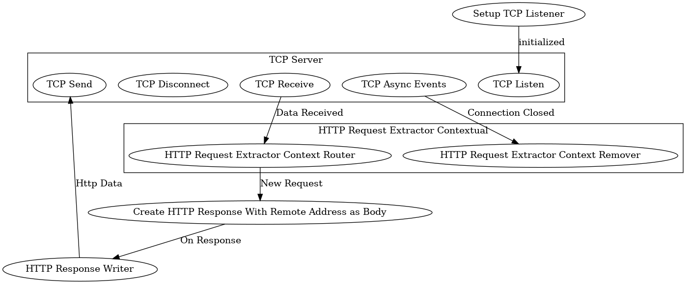

Two text files can be used to build and implement a graph.

One is the architecture file which specifies how everything is connected,
and the other is the implementation file which maps the nodes in the
architecture file to logic.

These files are fed to `buildDataGraph()` and `implementDataGraph()` to
create the executable graph.

## Architecture File

The architecture file is used to build the connections in the graph. It's
compatible with DOT file renderers, which makes it easy to see high-level
architecture without needing to create separate graphs. This is the driving
idea behind maplang: diagrams as code.

For example, the
[ip-echo-architecture.dot](../ip-echo-demo/ip-echo-architecture.dot) results
in 

There are some conventions to note when building architecture files.

First, the current syntax for subgraphs (like "TCP Server" in the above
example) requires the name to start with "Cluster". It will still work
without the Cluster prefix, but it won't be grouped together when rendered
to a diagram.

Second, the output channel of a node uses the edge's "label" property. It's
not intuitive, and will be changed to "channel" once a better renderer is
built (label will be deprecated at that point, but kept for
backwards-compatibility).

## Implementation File

The implementation file connects classes to individual nodes in the graph.

This is a JSON file.
[IP Echo Example](../ip-echo-demo/ip-echo-implementation.json)

TODO: define syntax for the architecture and implementation files.
